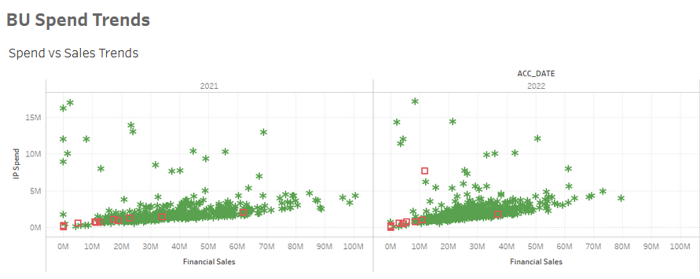
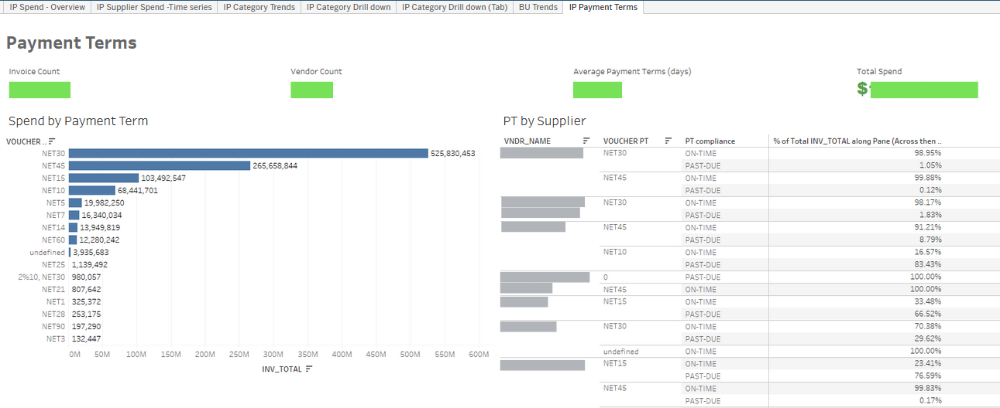
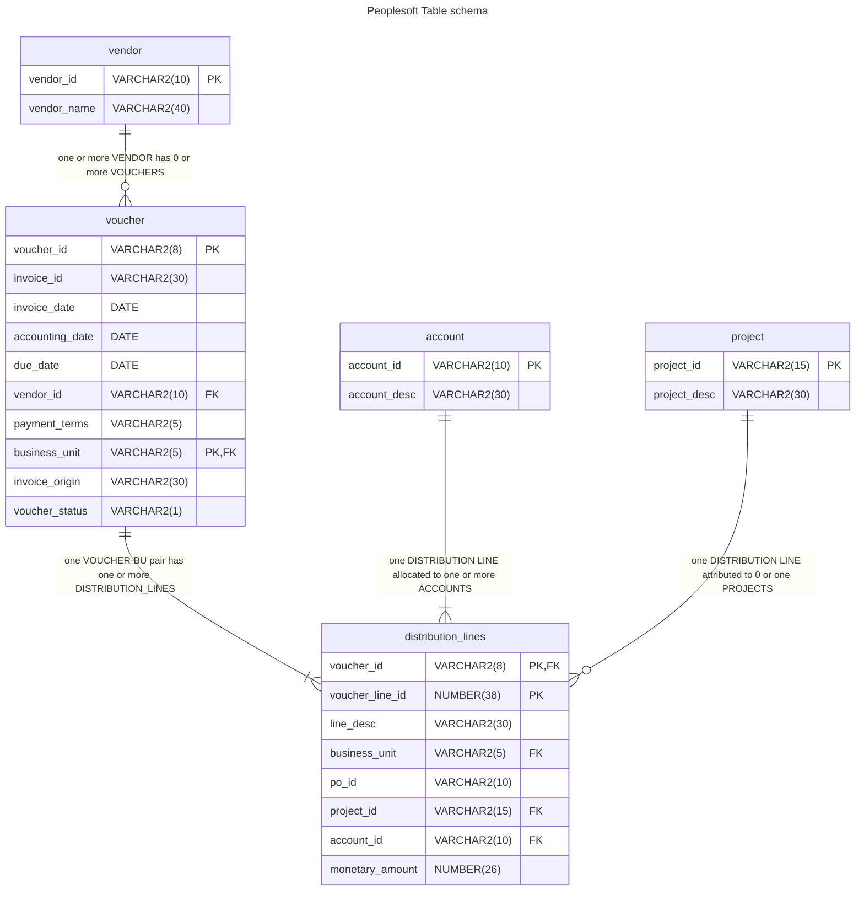

# Project Showcase: End-to-End Spend Analytics Solution
Present is a real customer case, but respecting confidentiality all data was replaced with dummy and any database schemas are high-level approximations.

## Motivation
Customer's procurement team was underserved from Technology / Analytics perspective and suffered from the limited access to spend data. This directly impacted their efficiency and ability to find cost optimization opportunities, identify potential compliance risks or track spend trends overtime. 

The only tool they had was macro-enabled Excel document (further referred as 'master'), which was only capable of providing high-level monthly summary metrics per supplier, was not user friendly to a general business user, and was tedious to maintain. Team had access to all the raw data and tools, but lacked the skill set to convert them into fully operational spend analytics solution.

## Legacy solution
Legacy tool was hard to maintain, could not be used by an average business user, did not scale well and couldn't provide required level of details. 

High-level Legacy workflow:
1. Analyst would schedule multiple queries in PeopleSoft to pull 4 tables monthly and manually download files.
2. Manually adjust naming conventions in the newly generated files, clean reference data, compare existing reference files to new and implement changes to existing files linked to the master.
3. Gather additional data from peers regarding updates to reference data (like list of active Business Units).
4. Refresh querries in the master.
5. Once a year update master model to include all 12 months data

## Toolkit
In the interest of maintainability technology choice was dictated by the existing tools used by the customer:
- Peoplesoft - ERP;
- Alteryx - ETL engine and orchestration;
- FSx File Server - storage where Alteryx server has read/write access to flat-files;
- Tableau - BI Platform.

## Proposed Solution Overview
 Automated ETL(Extract-Transform-Load) Pipeline from ERP to BI Dashboard, batch-processing AP data, cleansing and enriching with data from other enterprise systems. High-level pipeline overview:
 - Alteryx Server triggers workflow on monthly schedule;
 - Workflow pulls PeopleSoft tables, combines them, cleans, merges with historical data and then enriches with data from files on S3, and FSx Fileshare; 
 - Processed dataset is pushed to Tableau server and saved on FSx as Alteryx Database file.
 
 


## Results

Resulting product is a multi-tab Tableau Dashboard helping team to track core spend stats, like:
  - Spend per Supplier / Category / Location; 
  - Invoice Count and average invoice amounts per Supplier / Location; 
  - Category spend trend analytics (supplier mix, and how it changed over past 5 years; Region split, etc.);
  - Payment Terms.





New Spend Analytics Solution had multiple effects on the team:
- For the first time team gained access to their spend data at scale and was able to compare the spend by category, supplier, time period or geography;
- Such visibility enabled team to identify over $120M worth of cost-optimization opportunities and deploy 2-year program to execute them;
- Business users can now self-serve analytics without need to rely on more tech-savvy teammates, procurement data is now widely available across all orgs;
- Time required to maintain the spend analytics solution has  decreased from 120 to just 2 hours per year;
- This foundational pipeline allowed team to work on a deeper layers of analysis combining spend data with Sales, Logistics and Contract data.

## Detailed Process
If you are not interested in the technical details of how the solution was built you can stop reading here. 

### Extract
So the first step was to get the data from the ERP, but before we dive into detailes of the table schema, there are few things you need to know about Accounta Payable (AP) lifecycle and records. 

You are probably familiar with the general flow of **Purchase Order created** -> **Goods delivered / Services Rendered** -> **Invoice received** -> **Payment**. But Accounting is not there only to support actual transaction,they also take care of bookkeeping. So some AP specifics you may not be aware of is that between reciving the invoice and submitting it for payment AP team would normally create additional abstractions called **Voucher** and **Distribution line**. 

**Voucher** is a formal record, usually internal, that authorizes the payment of a vendor invoice. It summarizes the key details of the purchase, including: Vendor information, Invoice date and number, Purchase order number (if applicable), Description of goods or services, Amount owed, Payment terms, Approval signatures. The voucher serves as a central document for tracking the invoice from receipt to payment. It ensures that all necessary information is readily available and verifies that the payment is valid before it's processed.

**A distribution line** is a sub-component of a voucher that specifies how the total payment amount will be allocated across different accounts in the company's general ledger. It typically includes: Account code(s), Department or cost center, Project or other internal reference, Amount to be distributed to each account.

By using distribution lines, companies can track the costs associated with specific purchases and ensure accurate financial reporting. For example, if an invoice covers office supplies for different departments, you might have separate distribution lines for each department's expense account.

This context might help you make more sense of the below schema. It represents relation between all fields identified as required for the Spend Analytics solution. 


 Every record in `VOUCHER` table matches to at least one `DISTRIBUTION LINE`. And reference tables contain additional dimensions for `VENDOR`, `ACCOUNT` and `PROJECT` objects. SQL query seems straigthforward, however `ACCOUNT` and `VENDOR` tables contained duplicate keys, meaning these tables have many-to-many relationship to `VOUCHER` and `DISTRIBUTION LINE`. As identified later this was due to both tables contained records about inactive / historical accounts and vendors. This complexity still could be solved with use of window functions and common table expressions or temporary tables, so the query could look something like this:

``` sql
-- initialize [ven] CTE to store unique vendor records by showing active vendors first and recording row number for every record in each vendor_id. Meaning if rn > 1 then record is a duplicate. 
WITH ven
     AS (SELECT vendor_id,
                vendor_name
         FROM  (SELECT vendor_id,
                       vendor_name,
                       vendor_status,
                       Row_number()
                         OVER(
                           partition BY vendor_id
                           ORDER BY vendor_status) rn
                FROM   vendor)
         WHERE  rn = 1),
-- initialize [acc] CTE to store unique account records following same logic as for ven
     acc
     AS (SELECT account_id,
                account_descr
         FROM  (SELECT account_id,
                       account_descr,
                       effective_dt,
                       effective_status,
                       Row_number()
                         OVER(
                           partition BY account
                           ORDER BY effective_dt DESC, effective_status) RN
                FROM   account)
         WHERE  rn = 1)

SELECT A.voucher_id,
       A.invoice_id,
       A.vendor_id,
       ven.vendor_name,
       A.invoice_dt,
       A.accounting_dt,
       A.invoice_origin,
       B.monetary_amount AS inv_line_total,
       B.account_id,
       acc.account_desc,
       B.project_id,
       D.project_desc
FROM   voucher A
       JOIN distribution_lines B
         ON A.business_unit = B.business_unit
            AND A.voucher_id = B.voucher_id
       JOIN ven
         ON A.vendor_id = ven.vendor_id
       JOIN acc
         ON B.account = acc.account
       LEFT JOIN project D
              ON B.project_id = D.project_id
-- Dates are used as placeholders and overridden with Alteryx Dynamic Input tool
WHERE  A.accounting_dt >= To_date('2023-02-01', 'YYYY-MM-DD')
       AND A.accounting_dt <= To_date('2023-02-02', 'YYYY-MM-DD')

ORDER  BY A.business_unit,
          A.voucher_id,
          B.voucher_line_num  

```
However since we strive to keep focus on solutions's maintainability and knowing that main data transformation would anyway happen within Alteryx it was decided to keep SQL queries concise and straightforward. This led me to pulling reference tables separately and joining them in Alteryx. This way `PROJECT`, `VENDOR`, and `ACCOUNT` queries were trimmed down to simple `SELECT... FROM...` statement and main query was left with 2 tables and only 1 join.

As per conversation with the customer it was decided to keep the update cadence as monthly. In practice this was implemented through schedule on Alteryx Server and Dynamic Input tool to dynamically replace dates in the query.

## Transform

Full Alteryx workflow 
Category mapping was created and maintained separately with set of categorization rules defined for various GL-Supplier combinations. 


    '''WORK IN PROGRESS'''
    pull workflow from datashaper and configure dynamic input tool
    clean-up reference tables load
    check if vendor details reference should be added as well
    provide explanation to selecting to store .yxdb data files vs exporting to Teradata (lack of external users)

## Delivery to user
Resulting dataset is loaded to:
- FSx folder for ease of access to processed data in case of any ad-hoc requests from stakeholders;
- Tableau Server for creating a BI layer for users to self-serve core spend insights.

Tableau dashboard has 


