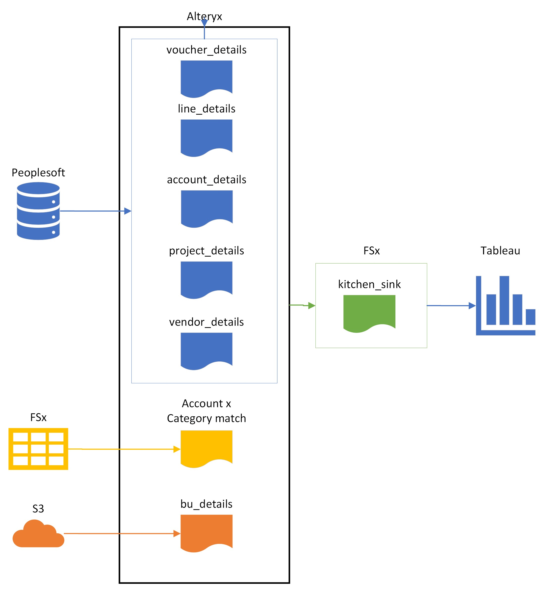
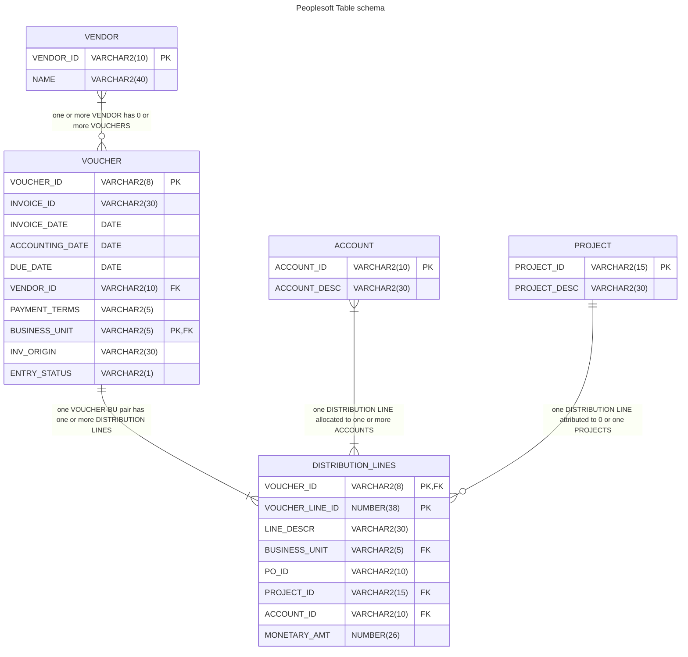

# Project Showcase: End-to-End Spend Analytics Solution
Present is a real customer case, but respecting confidentiality all data was replaced with dummy and any database schemas are high-level approximations.

## Motivation
Customer's procurement team was underserved from Technology / Analytics perspective and suffered from the limited access to spend data. This directly impacted their efficiency and ability to find cost optimizaton opportunities, identify potential compliance risks or track spend trends overtime. 

The only tool they had was macro-enabled Excel document (further refered as 'master'), which was only capable of providing high-level monthly summary metrics per supplier, was not user friendly to a general business user, and was tedious to maintain. Team had access to all the raw data and tools, but lacked the skillset to convert them into fully operational spend analytics solution.

## Legacy solution
Legacy tool was hard to maintain, could not be used by an average business user, did not scale well and couldn't provide required level of details. 

High-level Legacy workflow:
1. Analyst would schedule multiple queries in PeopleSoft to pull 4 tables monthly and manually download files.
2. Manually adjust naming conventions in the newly generated files, clean reference data, compare existing reference files to new and implement changes to existing files linked to the master.
3. Gather additional data from peers regarding updates to reference data (like list of active Business Units).
4. Refresh querries in the master.
5. Once a year update master model to include all 12 months data

## Toolkit
In the interest of maintainability technology choice was dictated by the existing tools used by the customer:
- Peoplesoft - ERP;
- Alteryx - ETL engine and orchestration;
- FSx File Server - storage where Alteryx server has read/write access to flat-files;
- Tableau - BI Platform.

## Proposed Solution Overview
 Automated ETL(Extract-Transform-Load) Pipeline from ERP to BI Dashboard, batch-processing AP data, cleansing and enriching with data from other enterprise systems. High-level pipeline overview:
 - Alteryx Server triggers workflow on monthly schedule;
 - workflow pulls PeopleSoft tables, combines them cleans, merges with historical data and then enriches with data from files on S3, and FSx Fileshare; 
 - Processed dataset is pushed into Tableau server and saved on FSx as Alteryx Database file.
 
 


## Results
New Spend Analytics Solution had multiple effects on the team:
- For the first time team gained access to their spend data at scale and was able to compare the spend by category, supplier, time period or geography;
- Such visibility enabled team to identify over $120M worth of cost-optimization opportunities and deploy 2-year program to execute them;
- Business users can now self-serve analytics without need to rely on more tech-savvy teammates, procurement data is now widely available across all orgs;
- Time required to maintain the spend analytics solution has  decreased from 120 to just 2 hours per year;
- This foundational pipeline allowed team to work on a deeper layers of analysis combining spend data with Sales, Logistics and Contract data.

## Detailed Process
If you are not interested in the technical details of how the solution was built you can stop reading now. 

### Extract
So source data is located in the ERP, but before we Before we dive into detailes of the table schema, there are few things you need to know about AP abstractions and lifecycle:


``` sql
WITH VENDOR AS (
    SELECT VENDOR_ID, NAME1
    FROM(
        SELECT VENDOR_ID,
            NAME1,
            VENDOR_STATUS,
            ROW_NUMBER() OVER(PARTITION BY VENDOR_ID ORDER BY VENDOR_STATUS) RN
        FROM PS_VENDOR)
    WHERE RN = 1),

    ACC AS (
    SELECT ACCOUNT,
	    DESCR
    FROM(
        SELECT  ACCOUNT, 
            DESCR,
            EFFDT,
            EFF_STATUS,
			ROW_NUMBER() OVER(PARTITION BY ACCOUNT ORDER BY EFFDT DESC, EFF_STATUS) RN
        FROM PS_GL_ACCOUNT_TBL 
        )
    WHERE RN=1
    )

SELECT A.VOUCHER_ID,
    A.INVOICE_ID,
    A.VENDOR_ID,
    C.NAME1 AS VENDOR_NAME,
    A.INVOICE_DT,
    A.ACCOUNTING_DT,
    A.OPRID AS INV_ORIGIN,
    A.VCHR_TTL_LINES AS INV_LINE_COUNT,
    A.GROSS_AMT AS INV_TOTAL,
    B.MONETARY_AMOUNT,
    B.ACCOUNT,
    ACC.DESCR AS ACCOUNT_DESCR,
    B.PROJECT_ID,
    D.DESCR AS PROJECT_DESCR
        
FROM PS_VOUCHER A
    JOIN PS_DISTRIB_LINE B ON A.BUSINESS_UNIT = B.BUSINESS_UNIT
        AND A.VOUCHER_ID = B.VOUCHER_ID
    JOIN VENDOR C on A.VENDOR_ID = C.VENDOR_ID 
    JOIN ACC on B.ACCOUNT = ACC.ACCOUNT
    LEFT JOIN PS_PROJECT D on B.PROJECT_ID = D.PROJECT_ID
    
WHERE A.ACCOUNTING_DT >= TO_DATE('2023-02-01','YYYY-MM-DD') 
    and A.ACCOUNTING_DT <= TO_DATE('2023-02-02','YYYY-MM-DD') --Dates are used as placeholders and overriden with Alteryx Dynamic Input tool
    
ORDER BY A.BUSINESS_UNIT, A.VOUCHER_ID, B.VOUCHER_LINE_NUM

```