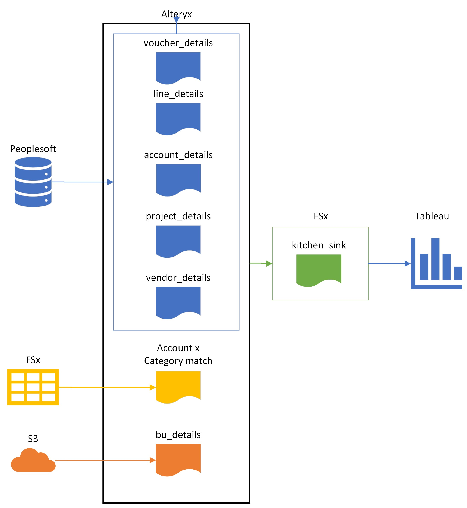

# Case Study: Spend Analytics solution for a non-tech team

## Solution overview 
Automated ETL Pipeline from ERP to BI Dashboard. Monthly batch-processing AP data cleanse and enrichment with data from other enterprise systems. High-level diagram:
 

## Motivation
Indirect Procurement team was underserved from Tech / Analytics perspective and suffered from the very limited access to spend data. The only tool they had was macro-enabled excel document (further refered as 'master'), and high-level workflow was like that:


## Toolkit
In the interest of maintainability Technology choice was highly dictated by the existing tools used by the client and:
Peoplesoft - ERP 


## Results


## Process
If you are not interested in the technical details of how the solution was built you can stop reading now. 

### Legacy workflow

Legacy tool was hard to maintain, could not be used by an average business user, did not scale well and couldn't provide required level of details. 
High-level Legacy workflow:

1. Analyst would schedule multiple queries in PS to generate 4 files monthly and manually download files.
2. Manually adjust naming conventions in the newly generated files, compare existing reference files to new and implement changes to existing files linked to the master.
3. Gather additional data from peers regarding updates to reference data (like list of active Business Units)
4. Refresh querries in the master

### Peoplesoft Schema


``` sql
WITH VENDOR AS (
    SELECT VENDOR_ID, NAME1
    FROM(
        SELECT VENDOR_ID,
            NAME1,
            VENDOR_STATUS,
            ROW_NUMBER() OVER(PARTITION BY VENDOR_ID ORDER BY VENDOR_STATUS) RN
        FROM PS_VENDOR)
    WHERE RN = 1),

    ACC AS (
    SELECT ACCOUNT,
	    DESCR
    FROM(
        SELECT  ACCOUNT, 
            DESCR,
            EFFDT,
            EFF_STATUS,
			ROW_NUMBER() OVER(PARTITION BY ACCOUNT ORDER BY EFFDT DESC, EFF_STATUS) RN
        FROM PS_GL_ACCOUNT_TBL 
        )
    WHERE RN=1
    )

SELECT A.VOUCHER_ID,
    A.INVOICE_ID,
    A.VENDOR_ID,
    C.NAME1 AS VENDOR_NAME,
    A.INVOICE_DT,
    A.ACCOUNTING_DT,
    A.OPRID AS INV_ORIGIN,
    A.VCHR_TTL_LINES AS INV_LINE_COUNT,
    A.GROSS_AMT AS INV_TOTAL,
    B.MONETARY_AMOUNT,
    B.ACCOUNT,
    ACC.DESCR AS ACCOUNT_DESCR,
    B.PROJECT_ID,
    D.DESCR AS PROJECT_DESCR
        
FROM PS_VOUCHER A
    JOIN PS_DISTRIB_LINE B ON A.BUSINESS_UNIT = B.BUSINESS_UNIT
        AND A.VOUCHER_ID = B.VOUCHER_ID
    JOIN VENDOR C on A.VENDOR_ID = C.VENDOR_ID 
    JOIN ACC on B.ACCOUNT = ACC.ACCOUNT
    LEFT JOIN PS_PROJECT D on B.PROJECT_ID = D.PROJECT_ID
    
WHERE A.ACCOUNTING_DT >= TO_DATE('2023-02-01','YYYY-MM-DD') 
    and A.ACCOUNTING_DT <= TO_DATE('2023-02-02','YYYY-MM-DD') --Dates are used as placeholders and overriden with Alteryx Dynamic Input tool
    
ORDER BY A.BUSINESS_UNIT, A.VOUCHER_ID, B.VOUCHER_LINE_NUM

```